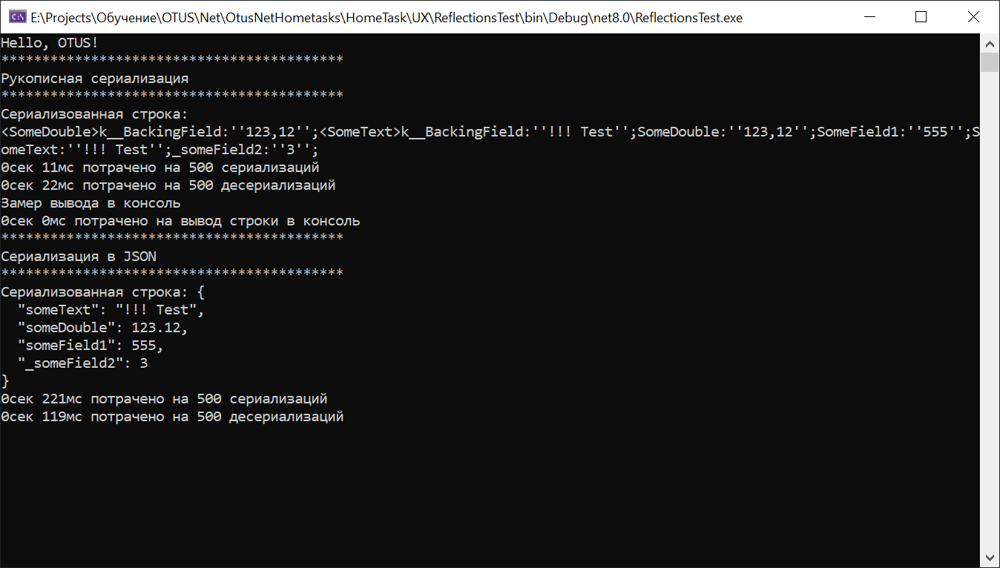
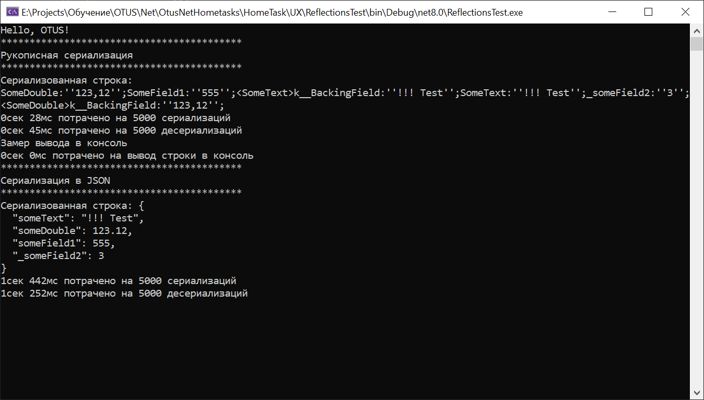

# Домашняя работа 4
## Рефлексия и её применение

# Цель:
Написать свой класс-сериализатор данных любого типа в формат CSV, сравнение его быстродействия с типовыми механизмами серализации. <br/>
Полезно для изучения возможностей Reflection, а может и для применения данного класса в будущем. <br/>

## Описание/Пошаговая инструкция выполнения домашнего задания:
* Написать сериализацию свойств или полей класса в строку
* Проверить на классе: class F { int i1, i2, i3, i4, i5; Get() => new F(){ i1 = 1, i2 = 2, i3 = 3, i4 = 4, i5 = 5 }; }
* Замерить время до и после вызова функции (для большей точности можно сериализацию сделать в цикле 100-100000 раз)
* Вывести в консоль полученную строку и разницу времен
* Отправить в чат полученное время с указанием среды разработки и количества итераций
* Замерить время еще раз и вывести в консоль сколько потребовалось времени на вывод текста в консоль
* Провести сериализацию с помощью каких-нибудь стандартных механизмов (например в JSON)
* И тоже посчитать время и прислать результат сравнения
* Написать десериализацию/загрузку данных из строки (ini/csv-файла) в экземпляр любого класса
* Замерить время на десериализацию
* Общий результат прислать в чат с преподавателем в системе в таком виде:


# Результаты выполнения ДЗ:

* Сериализуемы класс:
```
    public class ClassForTests
    {
        [JsonInclude]
        public int SomeField1;
        [JsonInclude]
        private int _someField2;

        public string SomeText { get; set; }
        public double SomeDouble { get; set; }

        public ClassForTests()
        {
            SomeField1 = 1;
            _someField2 = 3;
            SomeText = "hello";
            SomeDouble = 2.222;
        }

        public int GetSomeField2() => _someField2;
    }
```
* Сериализатор: [Реализация сериализаторов](https://github.com/fangarh/OtusNetHometasks/tree/t3/HomeTask/BusinessLogic/Logic/Serialization)

* **Проведено тестирование на 500 замерах**<br>
<br>
* Время сериализации и десериализации рукописным методом соответственно : 11мс и 22мс
* Время сериализации и десериализации JsonSerializer методом соответственно : 221мс и 119мс

* **Проведено тестирование на 5000 замерах**<br>
<br>
* Время сериализации и десериализации рукописным методом соответственно : 28мс и 45мс
* Время сериализации и десериализации JsonSerializer методом соответственно : 1c 442мс и 1c 252мс


# Выводы
* Стандартная сериализация медленнее рукописной, это связано с большим количеством проверок и более сложным форматом вывода.
* С самописным сериализатором немного перемудрил...